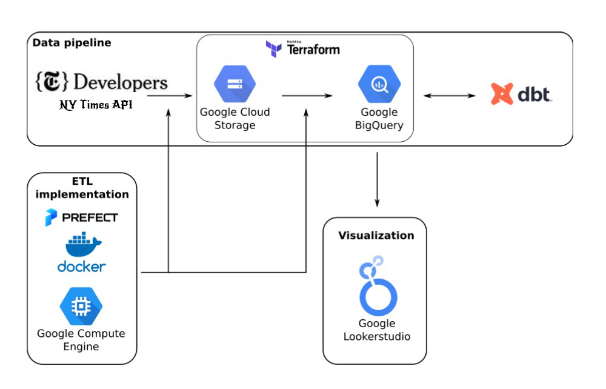
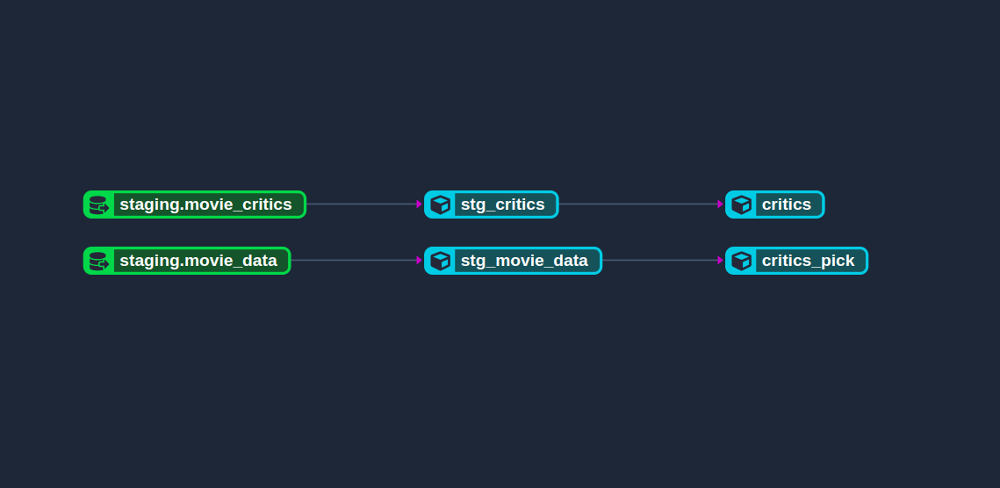

## Movie Reviews Data Engineering Project

I built a batch data pipeline that extracts, transforms and loads the [Movie Reviews from the NY Times Dev Portal](https://developer.nytimes.com/) into a Data Warehouse in the [Google Cloud Platform (GCP)](https://cloud.google.com/) and models the data in [Data build tool (dbt)](https://www.getdbt.com/).

## Project Description
A way to discover new movie reviews and movie recommendations

## Project architecture

### How the data pipeline works

* Prefect dataflows:

    1. [ETL Web to GCS](./prefect-workflows/web_to_gcs/etl_web_to_gcs.py): fetches movie reviews and critics data from the NY Times Developer Portal Movie Reviews API (Extract), process and arrange the columns (Transform), and loads the data into GCS (Load).

    2. [ETL GCS to BigQuery](./prefect-workflows/gcs_to_bq/gcs_to_bq.py): fetches data from GCS (Extract),  (Transform), and loads the data into BigQuery (Load).

* Dbt models:

    1. [stg_movie_data](./dbt_nyt_mr/models/staging/stg_movie_data.sql): selects columns from the raw table that was loaded into BigQuery

    2. [critics_pick](./dbt_nyt_mr/models/core/critics_pick.sql): selects all movie recommendations from critics

### Technologies

* [Pandas](https://pandas.pydata.org/) for fetching the dataset from the API endpoint.

* [Prefect](https://www.prefect.io/) and [Prefect Cloud](https://www.prefect.io/cloud/) for dataflow implementation and workflow orchestration.

* [Terraform](https://www.terraform.io/) for managing and provisioning infrastructure (GCS bucket, Data Warehouse) in GCP.

* [Docker](https://www.docker.com/) for encapsulating the dataflows and their dependencies into containers, making it easier to deploy them.

* [Data build tool (dbt)](https://www.getdbt.com/) for transforming, partitioning and clustering the dataset in the data warehouse.

* [Google Lookerstudio](https://lookerstudio.google.com/) for creating a dashboard to visualize the dataset.

## Results

### DBT Model Flow

